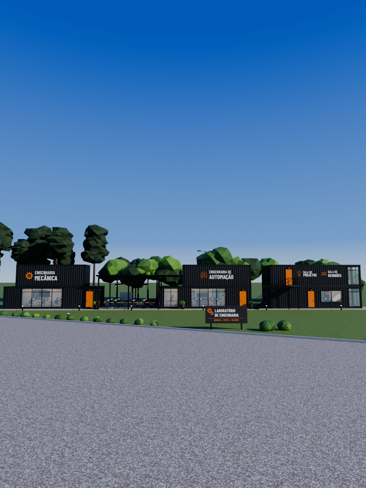
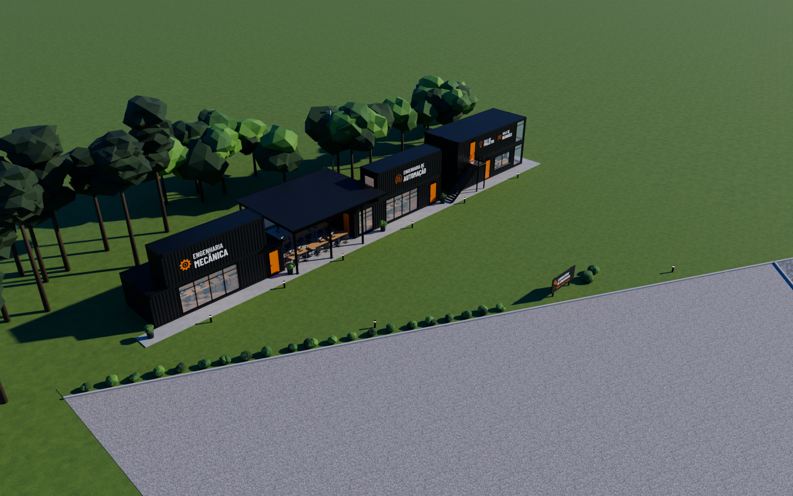
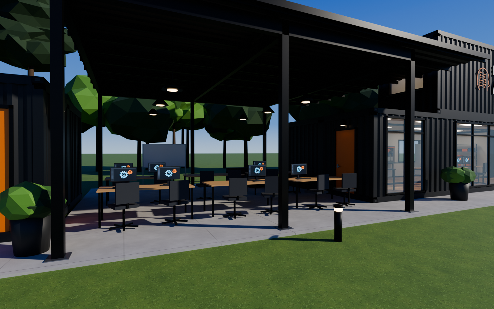
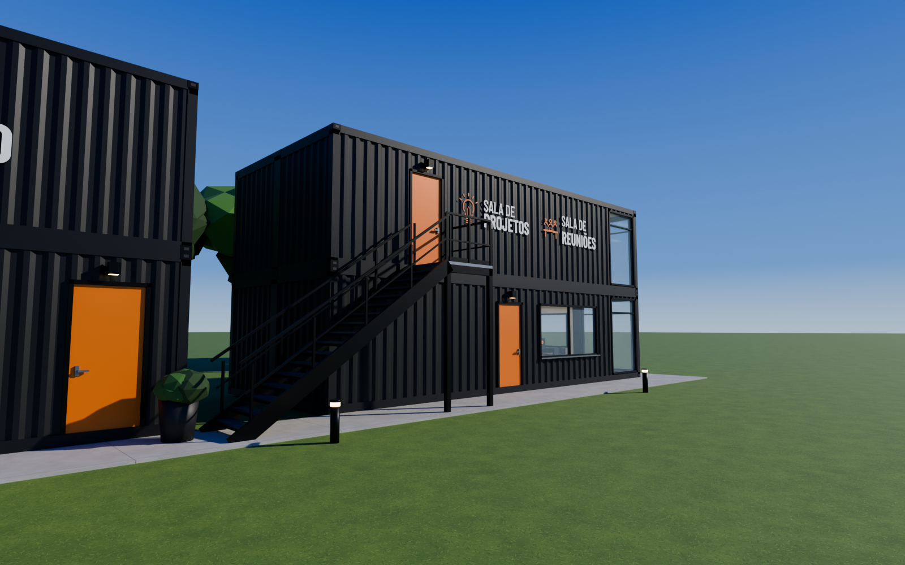

# Laboratório de Engenharia (P&D) — modelo 3D editável

Modelo 3D paramétrico do laboratório de P&D em contêineres marítimos: Engenharia Mecânica, pergolado de convivência, Engenharia de Automação, escada metálica, Sala de Projetos / Sala de Reuniões, placa de entrada, paisagismo e entorno.



| Aérea | Pergolado | Escada e salas |
|---|---|---|
|  |  |  |

## Arquivos prontos (`modelo3d/saida/`)

| Arquivo | Abrir com | Observação |
|---|---|---|
| `laboratorio_pd.blend` | Blender 4.2+ | Arquivo nativo: coleções por bloco, materiais PBR, câmeras e sol. Texturas embutidas. |
| `laboratorio_pd.glb` | Blender, 3ds Max, Twinmotion, Unreal, Unity, navegador | glTF binário com texturas. |
| `fbx/laboratorio_pd.fbx` | 3ds Max, Revit (via vínculo), Lumion, Unreal, Unity | Texturas embutidas. |
| `obj/laboratorio_pd.obj` + `.mtl` | Praticamente qualquer software 3D | Texturas copiadas na mesma pasta. |
| `dae_sketchup/laboratorio_pd.dae` | SketchUp (Arquivo > Importar > COLLADA) | Importe em metros. Texturas na mesma pasta. |
| `visualizador.html` | Navegador | Visualizador 3D com vistas, camadas, corte horizontal (planta) e medidas por peça. |
| `render_*.png` | — | Imagens renderizadas (Cycles) das câmeras do arquivo. |

Para usar o visualizador localmente, sirva a pasta por HTTP (o navegador bloqueia `file://`):

```bash
cd modelo3d/saida && python3 -m http.server 8000
# abra http://localhost:8000/visualizador.html
```

## O que está modelado

- **Contêineres High Cube** (40' e 30') com chapa trapezoidal corrugada real, colunas de canto, longarinas, cantoneiras ISO, cobertura, piso e portas originais com travas.
- **Térreos com planta livre**: dois contêineres de 40' unidos (4,88 m de profundidade) com drywall, forro, luminárias e piso de madeira.
- **Esquadrias**: panos de vidro com montantes, janelas com pingadeira, portas laranja com maçaneta e arandelas.
- **Pergolado metálico** (pilares, vigas, terças, telha trapezoidal), luminárias pendentes, bancadas com monitores, cadeiras, sofá e quadro branco.
- **Escada metálica** com 17 degraus, longarinas, guarda-corpos e patamar de acesso ao pavimento superior.
- **Interiores**: postos de trabalho, torno, fresadora, impressoras 3D, estantes, célula robótica, bancadas de CLP, painel elétrico, sala de reuniões com mesa, TV e cadeiras.
- **Placas** da fachada e placa de entrada com os textos da foto.
- **Terreno**: gramado em cunha, meio-fio, estacionamento em brita, calçada de paralelepípedo, arbustos, vasos, balizadores, árvores e poste.

## Editar e regenerar

Tudo é gerado por script, então dá para editar de duas formas:

1. **Direto no Blender**: abra `laboratorio_pd.blend`. Cada bloco está numa coleção (`01_Bloco_Engenharia_Mecanica`, `02_Pergolado_Area_Convivencia` ...) e cada peça tem nome próprio, com a origem na base, para mover, girar ou apagar.
2. **Por parâmetros**: edite `modelo3d/gerar_modelo.py` (seção `PARAMETROS`: posições dos blocos, contêineres, aberturas, mobiliário, posição da placa, câmeras) e rode:

```bash
pip install bpy==4.2.0 pillow numpy      # ou use o Blender 4.2 instalado
cd modelo3d
python gerar_texturas.py                 # só se mudar textos das placas ou texturas
python gerar_modelo.py                   # gera .blend, .glb, .fbx, .obj e .dae em saida/
python gerar_modelo.py --render          # idem + renders (Cycles, CPU)
# alternativa: blender --background --python gerar_modelo.py -- --render
```

Os textos das placas ficam em `gerar_texturas.py` (`PLACAS` e `PLACA_PRINCIPAL`).

Eixos (Blender): X ao longo da fachada, Y em profundidade (fachada principal em Y = 0, fundos para +Y), Z para cima. Unidades em metros.

## Medidas principais

| Elemento | Dimensões |
|---|---|
| Contêiner HC 40' | 12,192 × 2,438 × 2,896 m |
| Contêiner HC 30' | 9,125 × 2,438 × 2,896 m |
| Bloco Mecânica | térreo 2 × 40' + superior 30' |
| Bloco Automação | térreo 2 × 40' + superior 30' |
| Bloco Salas | térreo 2 × 40' + superior 2 × 40' |
| Pergolado | 7,85 × 8,10 m, altura livre ≈ 3,9 m |
| Escada | 17 espelhos de 17,8 cm, pisada 25,5 cm, largura 1,20 m |

As medidas foram estimadas a partir da foto e dos padrões ISO de contêineres; confira as cotas reais no local antes de usar o modelo para projeto executivo.

## Licenças

A fonte Barlow Condensed (`modelo3d/fontes/`) é distribuída sob a SIL Open Font License 1.1 (ver `OFL.txt`).
